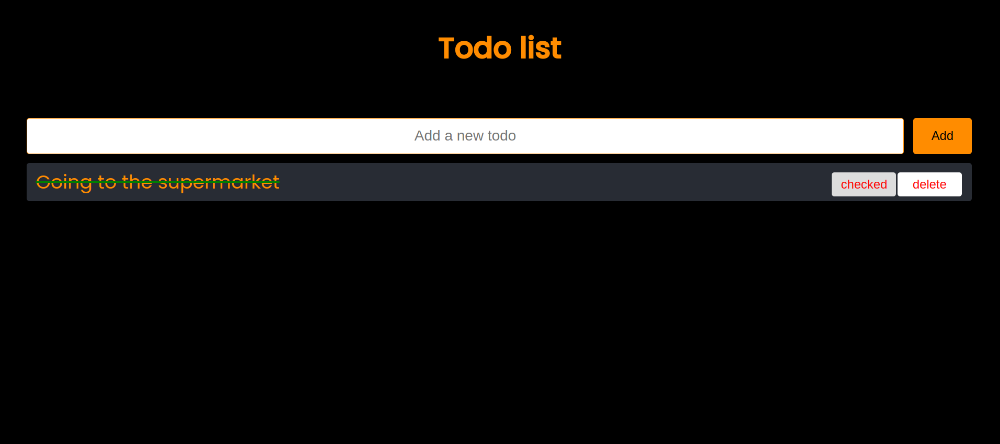

# React Todos

> The Todo List application is designed to help users manage their daily tasks. The application allows users to add new tasks (todos), edit existing tasks, and delete tasks. This project will demonstrate the fundamental concepts of React, including state management, component lifecycle, and event handling.

## Screenshot



## Technologies

- JavaScript
- HTML5
- CSS3
- VSC code
- React


## Set up

1. npm create vite@latest
2. npm i
3. npm run dev to open the server
4. create .prettierrc
5. npm run format
6. npm install -g prettier


## Code Examples

```React
const Form = ({ addTodo }) => {
    const [input, setInput] = useState('');
    const [error, setError] = useState(false);
    const changeHandler = (e) => {
        if (e.key === 'Enter') {
            return;
        }
        setError(false);
        setInput(e.target.value);
    };
```

## Features

Task Addition: Input field and button to add new tasks.
Task Listing: Display all tasks in a list format.
Task Deletion: Ability to delete tasks.
Task Completion: Mark tasks as Checked.
